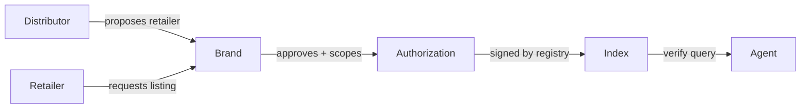

# Authorized Retailers Specification v0.1

Draft v0.1 · 23 September 2026  
Editor: Ed Jacobs

Licensed under [CC BY 4.0](https://github.com/authorizedretailers/spec/blob/main/LICENSE-docs). JSON Schemas and reference code: Apache-2.0.

## 1. Overview and scope

This spec defines how a brand publishes which retailers it has authorized to sell its products, and how an AI shopping agent verifies that status before buying. It is an open format: anyone may publish, read or index these files. authorizedretailers.ai operates a reference registry and index built on it.

Status: draft v0.1, for discussion with brands, retailers and agent developers. Breaking changes are expected before v1.0. Changes made since the first draft are listed in section 14.

The spec asserts one thing: whether a brand has authorized a given seller, on a given channel, in a given territory, for a given product scope, as of a given date.

It does not assert:

- **Authenticity.** An authorized seller can still sell counterfeit goods or have its account compromised. Authorization and authenticity are separate questions.
- **Pricing.** The format carries no price, MAP or discount terms.
- **Legal status.** A seller not listed is unlisted, not unlawful. How an agent or platform acts on an unlisted result is its own decision.

The key words MUST, SHOULD and MAY are used as defined in RFC 2119.

## 2. Terminology

| Term | Meaning |
| --- | --- |
| Brand | The owner of a trademark whose products are sold, identified by a verified domain. |
| Retailer | Any seller authorized to sell the brand's products: a store, a marketplace seller or a website. |
| Distributor | A party that supplies retailers. A distributor MAY propose retailers but cannot authorize them. |
| Authorization | A brand's signed statement that a retailer may sell within a stated scope until a stated expiry. |
| Channel | A place a seller sells, such as a marketplace in one country or a web domain. |
| Observation | Evidence from outside the brand's list that an authorized seller is actively selling on a channel. |
| Registry | A service that verifies brands, stores authorizations, signs them and answers verification requests. |
| Index | The registry's collected copy of every published file. Only registry-signed files count (section 5). |
| Agent | Any automated system that queries authorization status before recommending or buying. |

## 3. Authorization model

Every authorization MUST come from the brand. No other party can authorize a retailer, including distributors and the registry itself.



Distributors and retailers can request an authorization. Only the brand's approval creates one. Anything the brand has not approved verifies as unlisted.

Each authorization MUST carry a scope:

- **Territories:** ISO 3166-1 alpha-2 country codes, or `*` for worldwide. Scope by territory is required because the same brand may have different owners or distributors in different countries.
- **Channels:** the channel identifiers the authorization covers (section 6).
- **Product lines:** named product lines or `all`. SKU-level scope is reserved for a later version.
- **Expiry:** a date after which the authorization is no longer valid unless the brand reconfirms it.

An authorization MAY record the distributor that proposed it, so brands can see their supply chain.

## 4. Brand identity and domain verification

A brand is identified by its primary web domain. A registry MUST verify control of that domain before accepting any authorization from it.

The registry issues a random token, and the brand proves control by one of two methods:

1. **DNS TXT record** (preferred): `authorizedretailers-verify=<token>` on the brand's domain.
2. **Hosted file:** the token at `https://<brand-domain>/.well-known/authorized-retailers-verify.txt`.

Domain control does not prove brand ownership, because a counterfeiter can register a lookalike domain and verify it. A registry MUST also link the domain to the brand through at least one independent source, such as the domain listed on the brand's trademark filing, official website or marketplace storefront. Until that link is made, the brand's listings MUST be marked `domain_unlinked`.

The registry SHOULD recheck the verification record at least weekly. If it disappears, the registry MUST flag the brand's listings as `verification_lapsed` and notify the brand. It MUST NOT keep returning `authorized` indefinitely on a lapsed domain.

## 5. The authorized-retailers.json file

A brand publishes its authorizations at `https://<brand-domain>/.well-known/authorized-retailers.json`, served as `application/json` over HTTPS.

The file takes one of three forms:

| Form | Contents | Use when |
| --- | --- | --- |
| Full | The complete signed list | The brand wants its list public |
| Pointer | A URL to the brand's signed list on a registry | The list is maintained on a registry and should stay current without re-uploading |
| Private | Brand identity and a verify endpoint, no retailers | The brand does not want its distribution network public |

Full form example:

```json
{
  "spec": "authorized-retailers/0.1",
  "form": "full",
  "brand": { "name": "Example Brand", "domain": "examplebrand.com" },
  "issued": "2026-09-23T00:00:00Z",
  "expires": "2026-12-22T00:00:00Z",
  "authorizations": [
    {
      "id": "auth_01J9X2",
      "retailer": { "name": "Example Retail LLC", "entity_id": "ent_7Q4M" },
      "channels": [
        { "type": "amazon", "marketplace": "US", "seller_id": "A1B2C3D4E5F6G7" },
        { "type": "walmart", "marketplace": "US", "seller_id": "101234567" },
        { "type": "web", "domain": "exampleretail.com" }
      ],
      "scope": { "territories": ["US", "CA"], "product_lines": ["all"] },
      "proposed_by": null,
      "expires": "2026-12-22T00:00:00Z"
    }
  ],
  "signature": { "kid": "ar-2026-09", "jws": "<detached JWS>" }
}
```

Pointer form: `{"spec": "authorized-retailers/0.1", "form": "pointer", "brand": {...}, "list": "https://authorizedretailers.ai/v0/brands/examplebrand.com/list"}`.

Private form: `{"spec": "authorized-retailers/0.1", "form": "private", "brand": {...}, "verify": "https://authorizedretailers.ai/v0/verify"}`.

An individual authorization's `expires` MUST NOT be later than the file's `expires`. Readers MUST treat an expired file as containing no valid authorizations. A file counts only if it is signed by a registry (section 8): a brand publishes the file its registry generated for it, or a pointer to it. Readers MUST treat an unsigned file, or one whose signature does not verify against a registry's published keys, as no file at all. Readers MUST also check that the file's `brand.domain` is the domain it was fetched from, since a file vouches only for its own domain.

## 6. Seller identity and channel identifiers

Agents see sellers as channel identifiers, not company names, so every authorization MUST name at least one channel identifier. A name alone is not verifiable.

| Channel type | Required fields | Identifier |
| --- | --- | --- |
| `amazon` | `marketplace`, `seller_id` | Amazon merchant ID for that marketplace |
| `walmart` | `marketplace`, `seller_id` | Walmart Marketplace partner ID |
| `ebay` | `marketplace`, `seller_id` | eBay user ID |
| `web` | `domain` | The retailer's store domain |
| `physical` | `address`, `country` | Store location, for completeness; not verifiable by agents |

New channel types are added by registry proposal and published in the spec changelog.

A registry MAY group a retailer's identifiers under one `entity_id`, so one retailer selling on several channels is one record. Registry-proposed links between identifiers MUST be confirmed by the brand before they count as authorized. Agents MUST match on the channel identifier they see, never on the retailer name.

## 7. Evidence and observation

Every answer about a seller rests on the same evidence: a verified domain independently linked to the brand (section 4), the brand's own approval (section 3), and the registry's signature (section 8). There are no weaker grades of answer. Where that evidence is missing, the answer is `brand_unverified`, whether or not a file exists on the brand's domain.

A registry MAY also observe sellers: evidence from outside the brand's list that an authorized seller is actively selling the brand's products on the stated channel. Every answer MUST carry `observed`. On an `authorized` answer it is `{ "last_seen": <timestamp> }` when the registry has seen this seller selling within the last 30 days, and otherwise `null`. On every other status it MUST be `null`. Observation never changes the status.

In v0.1, the reference registry observes Amazon marketplaces only.

Observation can also raise flags on an authorized seller: sudden changes in account name, address, catalog or volume that suggest a compromised account. A registry MAY return these as `signals` alongside the answer, without changing the authorization status.

## 8. Signing and key management

Lists and verification answers are signed with a detached JWS (RFC 7515) over the JSON canonicalized per RFC 8785, using Ed25519 (`EdDSA`). Anyone can check a signature without trusting the registry's servers.

- **Public keys:** published at `https://authorizedretailers.ai/.well-known/jwks.json`. Every signature names the key that made it (`kid`).
- **Agent behavior:** agents SHOULD cache the key set and refetch it when they see an unknown `kid`. They MUST reject signatures from keys no longer in the set.
- **Scheduled rotation:** every 90 days. The new key is published at least 7 days before first use. The old key stays published until everything it signed has expired: the latest `expires` of any list it signed, and the latest `valid_until` of any verify answer it signed (section 9).
- **Emergency rotation:** a compromised key is removed from the set immediately, and every current list is re-signed with a new key. Short list expiry keeps this fast.
- **Storage:** registries SHOULD hold private keys in a managed key service, sign server-side, and never expose keys to application code or staff.

Brands do nothing during rotation. A pointer-form file always resolves to the current signature. A full-form file hosted by the brand SHOULD be kept in sync automatically by the registry's plugin or sync job.

In a later version, a brand MAY sign its own list with a key published on its own domain (bring your own key), with the registry countersigning.

## 9. Verify API and MCP interface

An agent asks one question: is this seller authorized for this brand, on this channel, in this territory? The answer is signed and the same whether the brand's list is public or private.

Request: `POST /v0/verify`

```json
{
  "brand_domain": "examplebrand.com",
  "channel": { "type": "amazon", "marketplace": "US", "seller_id": "A1B2C3D4E5F6G7" },
  "territory": "US",
  "product_line": "all"
}
```

Response:

```json
{
  "status": "authorized",
  "authorization_id": "auth_01J9X2",
  "expires": "2026-12-22T00:00:00Z",
  "checked": "2026-09-23T14:02:11Z",
  "valid_until": "2026-09-24T14:02:11Z",
  "observed": null,
  "signals": [],
  "signature": { "kid": "ar-2026-09", "jws": "<detached JWS>" }
}
```

| `status` | Meaning |
| --- | --- |
| `authorized` | A valid authorization covers this seller, channel, territory and product line |
| `unlisted` | The brand is verified and no valid authorization covers this request |
| `expired` | An authorization existed but has lapsed |
| `brand_unverified` | The brand has not verified its domain, or verification has lapsed |
| `disputed` | A dispute on this authorization is open (section 11) |

Every signed answer MUST carry `valid_until`, no later than 24 hours after `checked`. Agents MUST NOT rely on an answer after its `valid_until`.

A `brand_unverified` answer MAY carry a `reason`:

| `reason` | Meaning |
| --- | --- |
| `not_registered` | The registry holds no verified record for this brand. An unsigned file on the brand's domain doesn't count (section 5) |
| `domain_unlinked` | Domain control is verified, but the independent brand link (section 4) has not been made |
| `verification_lapsed` | The domain verification record has disappeared (section 4) |

`reason` MUST NOT appear on any other status.

Private mode: for brands using the private form, the API answers only the question asked. It MUST NOT return the brand's other retailers, and SHOULD rate-limit queries per caller to prevent the list being reconstructed by enumeration. Any endpoint that returns a list (such as `/v0/brands/<domain>/list`) MUST respond to a private-form brand exactly as it responds to an unknown brand, with the same status code, headers and body, so a caller cannot tell that a private brand exists from that endpoint.

The same capability is exposed as MCP tools: `verify_seller` (the request above), `get_brand` (verification status, file form, last update) and, for full-form brands only, `list_authorized_retailers`.

## 10. Expiry, revocation and freshness

Every authorization expires. The maximum expiry is 180 days from issue, and the recommended default is 90 days. A list that nobody reconfirms stops being valid on its own.

- **Reconfirmation:** the registry reminds the brand 30 and 7 days before expiry. One confirmation renews every authorization the brand selects.
- **Revocation:** a brand can revoke an authorization at any time. The registry's verify API MUST reflect a revocation within 15 minutes.
- **Caching:** agents SHOULD NOT cache a verify answer past its `valid_until` (at most 24 hours), or cache a full-form file for more than 24 hours. A revocation can therefore take up to 24 hours to reach an agent that caches.
- **Retailer notice:** the registry SHOULD notify a retailer when its authorization is revoked or expires, if the retailer has registered.

## 11. Disputes and unclaimed listings

**Disputes.** A retailer can see its own status for any brand and can open a dispute if it believes a listing is wrong, for example a revocation it says was issued in error or an identifier mapped to the wrong entity.

1. The retailer submits the dispute with evidence.
2. The brand is notified and has 14 days to confirm, correct or reject.
3. While a dispute is open, verify answers return `disputed` only if the brand has flagged the authorization for review. Otherwise the brand's current decision stands.
4. The registry does not rule on commercial relationships. The brand's decision is final for authorization status. Identifier errors are corrected by the registry.

The registry's liability position, dispute timelines and data handling are set out in its terms of use, not in this spec.

**Unclaimed listings.** A registry MAY index authorized-retailer or dealer-locator pages that a brand already publishes, as `unclaimed` entries. These MUST be labeled as unverified, MUST NOT verify as `authorized`, and MUST link to the source page. A brand claims its listing by verifying its domain (section 4), after which the entries become editable and signable.

## 12. Security and privacy considerations

- **Brand impersonation:** mitigated by domain verification plus independent brand linkage (section 4). This is the highest-impact attack, because a false brand could authorize diverters.
- **Account takeover at the registry:** brand accounts MUST use multi-factor authentication. Revocations and new authorizations SHOULD trigger an email to every brand admin.
- **Compromised seller accounts:** an authorized seller's marketplace account can be taken over. Observation signals (section 7) help, but authorization does not guarantee the seller's current conduct.
- **List enumeration:** private-mode lists are protected by answering single questions only, with per-caller rate limits and query logging.
- **Personal data:** channel identifiers and business names are business data. Registries MUST NOT publish personal addresses of sole-trader retailers. `physical` addresses are shown only for storefronts.
- **Replay:** agents SHOULD check the `checked` timestamp on a signed answer and MUST reject answers past their `valid_until`.

## 13. Open questions for v0.2

- [ ] SKU-level scope: needed now, or can product lines carry v1?
- [ ] Multi-brand owners: how a holding company verifies once and manages several brand domains.
- [ ] Territory splits where the trademark has different owners by country: one brand record or several?
- [ ] Bring-your-own-key signing for large brands, and how countersigning works.
- [ ] Observation on channels beyond Amazon: Walmart and retailer web domains first?
- [ ] Alignment with UCP and ACP: an extension field that points agents to a brand's authorized-retailers file.
- [ ] Retailer-side verification: should retailers also verify their channel identifiers before a brand can list them?
- [ ] Brand-declared `unauthorized`: a status for sellers the brand has explicitly said are not authorized, as distinct from `unlisted`, with a dispute path for the seller.

## 14. Changelog

- **2026-09-23**
  - Verify answers carry `valid_until` (at most 24 hours after `checked`). Key retirement is based on it (sections 8, 9, 10, 12).
  - `brand_unverified` answers MAY carry a `reason` (`not_registered`, `domain_unlinked`, `verification_lapsed`) (section 9).
  - List endpoints respond to private-form brands exactly as to unknown brands (section 9).
- **2026-09-24**
  - Key storage in a managed key service is a SHOULD for every registry, replacing the description of one registry's setup (section 8).
  - Evidence tiers are removed. Every answer about a seller needs a verified, independently linked brand domain, the brand's approval and a registry signature; without them the answer is `brand_unverified` (sections 5, 7, 9).
  - Only registry-signed files count. An unsigned file, or one whose signature doesn't verify, is treated as no file, and a file vouches only for the domain it's fetched from (section 5).
  - Observation is a separate `observed` field (`{ "last_seen" }` or `null`) on every answer, instead of a tier (sections 7, 9).
